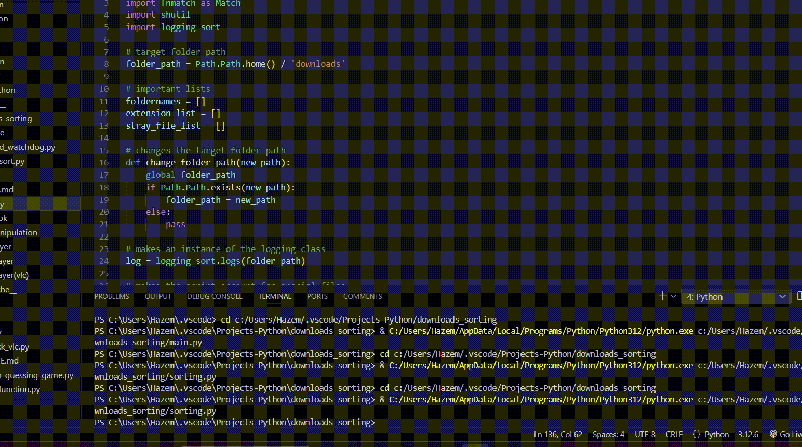
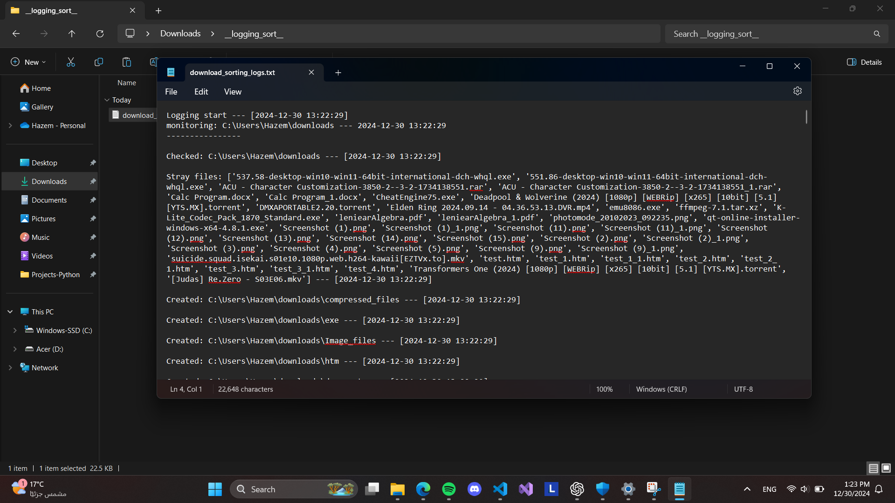
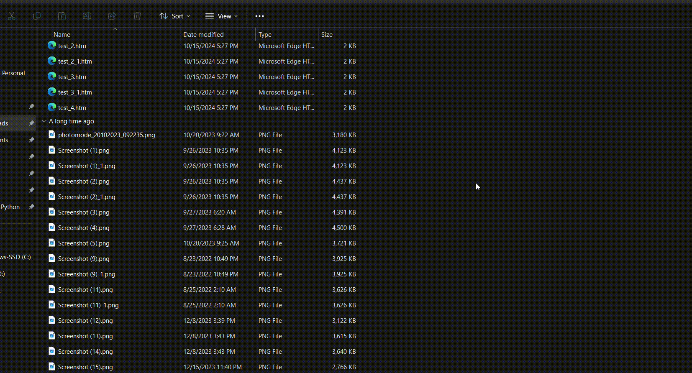

# Folder Sort

Folder Sort is a program that sorts files into designated folders. It can also keep monitoring the folder for changes and logs all events.  
The program uses **watchdog** for monitoring and **os**, **pathlib**, **fnmatch**, and **shutil** for file management.  
It is structured into four files:

1. **main.py**
2. **sorting.py**
3. **download_watchdog.py**
4. **logging_sort.py**

---

## main.py

This runs the program until a keyboard interrupt occurs.  
In it you can change:

1. **`folder_path`** – Changes the targeted folder.
2. **`special files`** – These are lists of grouped extensions that will have the same designated folder. The built-in ones are `videos`, `images`, `documents`, `audios`, and `compressed_files`.
   - You can choose to let the program account for them or not by changing `account_for_special_files` to `False`.
   - If you don't want, for example, `audios` to be grouped, add `= None` at the end. This will make the program create a separate folder for the extension.

---

## sorting.py

This includes all the important functions for the sorting process.

---

## logging_sort.py

Creates a `logs` class that creates a folder inside `folder_path` and a text file, where all logs are documented with timestamps.

---

# One-Time Sort

While **main.py** runs continuously with monitoring, you can run **sorting.py** on its own to sort the folder, log the changes, and stop immediately.

- In this case, the `folder_path` can still be changed at the start of the code.
- The `special files` lists can be found at the end in `if __name__ == "__main__"`.

It is possible to add a new extension grouping, just not as easily.

- In **sorting.py**, create the new extension list in `special_condition` and add it to `conditions_extensions`.
- Ensure the index matches in `conditions_extensions`, `condition_folder_names`, and `condition_flags`.

---

## download_watchdog.py

Manages the monitoring functionality with **watchdog**.

### Important Functions and Information:

1. **`order_of_operation()`** – Calls `check_all_files()`. If stray files are detected, it creates folders and triggers sorting.
2. **`start_sort()`** – If `start_real_work_flag` is `True`, it calls `sort_it()`.
3. **`before_start()`** – Before monitoring can begin, this starts the operation once.
4. **`run()`** – Calls `before_start()`, then starts monitoring in a separate thread and ensures the program runs until a keyboard interrupt.
5. **`start_watching()`** – Creates an instance of `WatchHandler()`, then an `Observer()` from **watchdog** to monitor `folder_path`. It starts `watch`, and there is another while loop here.
6. **`WatchHandler()`** – A class that inherits from `FileSystemEventHandler`.
   - Implements a debounce timer to reset if called within 2 seconds.
   - The timer triggers `start_sort_on_timer()`, which starts sorting by calling `order_of_operation()`.
   - If `start_real_work_flag` is `True`, it proceeds to `start_sort()`.
   - The debounce timer activates if a file is created, deleted, or moved.

---

## Important Functions in sorting.py

1. **`check_all_files()`** – Scans `folder_path` for files.
   - Sets `flag` to `True`. If the file is not a folder, it is added to `stray_file_list`.
   - Checks extensions against `conditions_extensions`. If a match is found, the folder name is added to `extension_list`.
   - Returns `stray_file_flag` and `foldernames`.
2. **`create_folder()`** – Iterates over `foldernames` and creates folders with `.mkdir` if they don't exist.
3. **`sort_it()`** –
   - Loops through `stray_file_list` and compares files with `foldernames`.
   - Moves or renames files based on matching extensions.
   - Special files are handled by `sort_condition()`.
4. **`rename()`** – Renames files by appending numbers until a unique name is found, then moves the file.
5. **`sort_condition()`** – Handles sorting of special files using the conditions defined in `conditions_extensions`.
